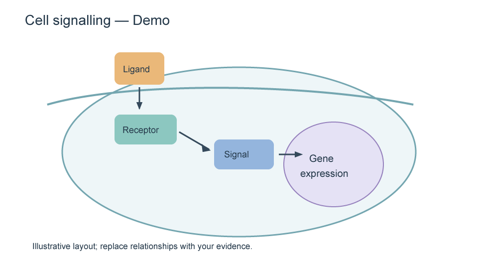

# Illustrator / PowerPoint 科研绘图

机制图、实验流程图、图形摘要和本地矢量重绘；保留路径和 live text。

## 安装与调用

复制整个目录到你的 Codex skills 目录，或在 discovery SKILL.md 中路由到完整包。使用 `$scientific-draw`，同时提供数据/参考图及目标输出。

## 依赖和边界

Windows、Illustrator、PowerPoint；Python 依赖见 requirements.txt。

完整操作规则见 [SKILL.md](SKILL.md)。不包含用户实验数据、软件安装程序或凭据。

## 快速开始

```powershell
python -m pip install -r requirements.txt
python scripts/draw.py --svg assets/mechanism.svg --application both --out C:\Figures\demo-01
```

输出目录必须不存在。ai/ppt/both 可选择输出。真实桌面程序通过 COM 调用，测试默认新建文档。复杂 SVG、渐变/滤镜、复杂照片和自动 OCR 不保证支持。支持范围和作者测试记录见 references/。

## 预览



图中关系仅为示例，实际机制必须以研究证据为依据。后端改编自 yrui-cmd/cell_su7（MIT），署名和许可证保留于 THIRD_PARTY_NOTICES.md 和 scripts/vendor/LICENSE。
